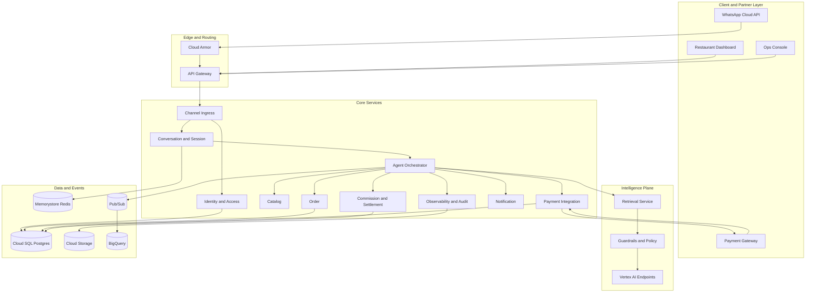
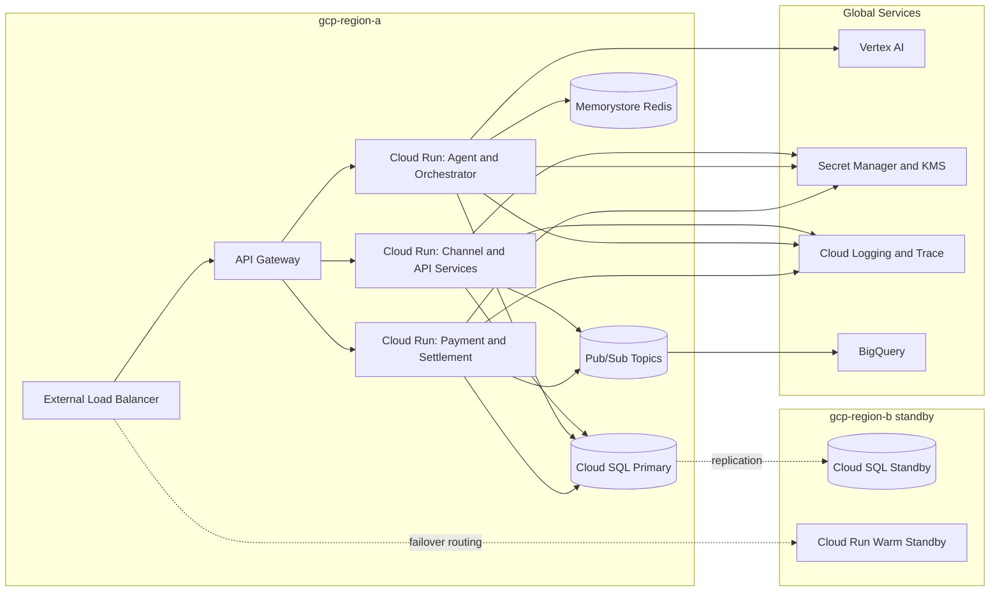
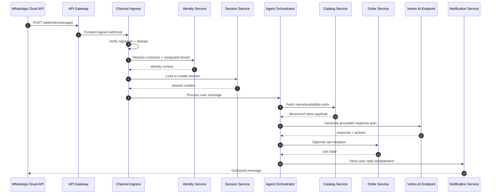
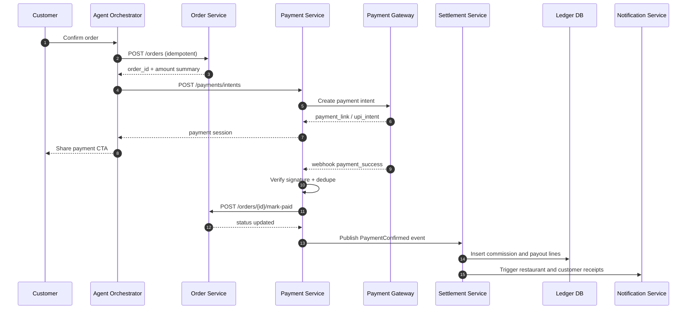
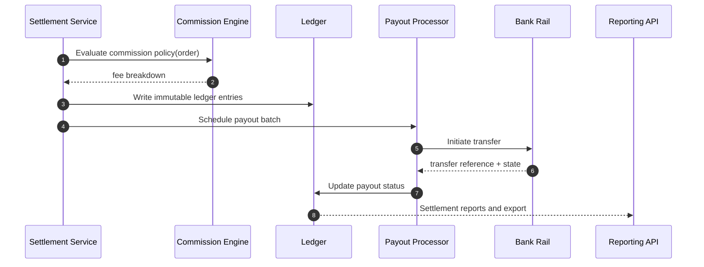

# Dzukku CTO Deep-Tech Architecture

Version: 1.0  
Date: 2026-04-06  
Audience: CTO, Principal Engineers, Platform Leads  
Status: Implementation Blueprint

## 1. Scope

This document extends the production architecture with:
- Request/response and event-level sequence design
- Service APIs with contracts and idempotency strategy
- Infrastructure sizing for MVP, growth, and scale
- Reliability, failure mode, and disaster recovery posture

## 2. System Context and Assumptions

## 2.1 Product Context

Dzukku is a direct restaurant commerce platform on WhatsApp with an agentic AI layer and low-commission settlement design.

## 2.2 Non-Functional Targets

- Availability target: 99.95% for customer-facing APIs
- P95 webhook processing: <= 400 ms (excluding LLM response latency)
- P95 order commit transaction: <= 800 ms
- P95 payment callback reconciliation: <= 2 s
- Recovery point objective (RPO): <= 5 minutes
- Recovery time objective (RTO): <= 30 minutes

## 2.3 Throughput Assumptions for Sizing

Baseline sizing input model:
- 2,000 onboarded restaurants
- 80,000 daily active customers
- 12 messages per customer-day average
- Peak traffic multiplier: 6x over daily average minute rate

Approximate load:
- Daily inbound messages: 960,000
- Average messages per second: 11.1
- Peak messages per second: ~67
- Peak webhook bursts planned for: 120 requests per second

## 3. Reference Deployment Topology (GCP)

- Ingress: Cloud Load Balancing + API Gateway
- Compute: Cloud Run for stateless services in MVP and growth
- Orchestration shift trigger: move high-chatter internal services to GKE when sustained CPU and queue depth exceed Cloud Run cost/perf threshold
- Data:
  - Cloud SQL for PostgreSQL (transactional)
  - Memorystore Redis (cache, rate limit counters, idempotency windows)
  - Pub/Sub (domain events)
  - GCS (documents, logs archive)
  - BigQuery (analytics)
- AI:
  - Vertex AI model endpoints
  - Vertex AI prompt and eval workflows
- Security:
  - Secret Manager
  - KMS keys with CMEK for critical stores
  - Cloud Armor at edge

## 4. Service Map and Ownership

1. Channel Ingress Service
- Webhook verification, dedupe, normalization

2. Identity and Access Service
- Customer and merchant identity graph, consent

3. Conversation and Session Service
- Session state, context windows, language profile

4. Agent Orchestrator Service
- Intent planning, tool selection, guardrail enforcement

5. Catalog Service
- Menu and inventory views per restaurant branch

6. Order Service
- Cart and order state machine

7. Payment Integration Service
- Payment intent orchestration and callback verification

8. Commission and Settlement Service
- Fee computation, ledger entries, payout schedules

9. Notification Service
- WhatsApp templates, outbound status updates

10. Observability and Audit Service
- Immutable transaction audit stream

## 4.1 Component Architecture Diagram

## 4.2 Deployment Architecture Diagram (GCP)

## 5. Core Data Contracts

## 5.1 Event Envelope

All domain events use a common envelope:

- event_id: UUID
- event_type: string
- event_version: integer
- tenant_id: string
- correlation_id: UUID
- causation_id: UUID
- produced_at: ISO timestamp
- payload: object

## 5.2 Idempotency Strategy

Write-side APIs require idempotency key:
- Header: Idempotency-Key
- Stored in Redis first for fast duplicate rejection
- Persisted with final state in PostgreSQL for replay safety
- TTL for dedupe cache: 24 hours (configurable by endpoint)

## 6. Sequence Diagrams

## 6.1 Customer Message to AI Reply

## 6.2 Order Placement and Payment Confirmation

## 6.3 Settlement and Payout Lifecycle

## 7. API Contract Drafts

## 7.1 Channel Ingress

POST /v1/webhooks/whatsapp
- Purpose: receive inbound WhatsApp events
- Auth: signature verification (provider secret)
- Idempotency: provider message id + internal dedupe token
- Success response: 202 Accepted

## 7.2 Session Query

GET /v1/sessions/{session_id}
- Returns:
  - session_id
  - customer_id
  - tenant_id
  - locale
  - context_window_metadata

## 7.3 Agent Processing

POST /v1/agent/messages

Request body:
- tenant_id
- customer_id
- session_id
- message
- channel
- client_event_time

Response body:
- response_text
- response_type (text, options, payment_cta)
- suggested_actions
- trace_id

## 7.4 Order APIs

POST /v1/orders
- Headers: Idempotency-Key required
- Request:
  - tenant_id
  - customer_id
  - cart_items
  - fulfillment_type
  - special_instructions
- Response:
  - order_id
  - order_state
  - price_breakdown

GET /v1/orders/{order_id}
- Response:
  - status timeline
  - payment state
  - fulfillment metadata

POST /v1/orders/{order_id}/mark-paid
- Internal endpoint used by Payment Service after verification

## 7.5 Payment APIs

POST /v1/payments/intents
- Headers: Idempotency-Key required
- Request:
  - order_id
  - amount
  - currency
  - payment_method_hint
- Response:
  - payment_intent_id
  - deeplink_or_qr
  - expires_at

POST /v1/webhooks/payments
- Signature verification required
- Emits PaymentConfirmed or PaymentFailed event

## 7.6 Settlement APIs

GET /v1/settlements/orders/{order_id}
- Returns per-order fee transparency line items

POST /v1/settlements/payouts/run
- Internal scheduled endpoint for payout batching

## 8. Order State Machine

States:
- DRAFT
- CREATED
- AWAITING_PAYMENT
- PAID
- CONFIRMED_BY_RESTAURANT
- PREPARING
- READY
- OUT_FOR_DELIVERY (optional)
- COMPLETED
- CANCELLED
- REFUND_PENDING
- REFUNDED

Transition controls:
- Payment callback can move only from AWAITING_PAYMENT to PAID
- Cancellation after PREPARING requires policy approval
- Refund states require policy and settlement reconciliation

## 9. Commission Engine Deep Design

## 9.1 Rule Evaluation Pipeline

1. Load active tenant commission policy
2. Resolve contextual multipliers:
- customer acquisition flag
- campaign tag
- payment mode
- SLA breach compensation
3. Apply deterministic formula and rounding policy
4. Emit explainable breakdown for dashboard and audit

## 9.2 Deterministic Formula Pattern

- gross = sum(item_totals) + delivery_fee
- tax = configured tax calculation
- processing_fee = gateway_rate * gross
- platform_fee = commission_rate * taxable_base
- restaurant_net = gross - tax - processing_fee - platform_fee

## 9.3 Ledger Guarantees

- Append-only ledger entries
- Double-entry representation for accounting compatibility
- Every payout linked to source order and policy snapshot

## 10. AI Architecture Deep Dive

## 10.1 Orchestration

- Planner model decides intent and tool sequence
- Tool calls are executed by backend, not by free-form model action
- Response model composes human-facing message from validated tool outputs

## 10.2 Model Routing Strategy

- Tier 1: low-latency lightweight model for intent classification
- Tier 2: richer generation model for conversational responses
- Tier 3: policy-specific model call for sensitive decisions (refund, compliance)

## 10.3 Prompt and Context Design

Context pack order:
1. Tenant and branch policy context
2. Session summary memory
3. Active cart and pricing facts
4. Retrieval snippets with source metadata

Hard constraints:
- No action execution without backend tool confirmation
- No policy claim without retrieval citation

## 10.4 AI Evaluation KPIs

- Intent accuracy
- Tool call correctness
- Hallucination incident rate
- Safe refusal correctness
- Cost per 1,000 interactions

## 11. Infra Sizing Guide

## 11.1 Sizing by Stage

MVP Stage (up to 120 RPS burst)
- Cloud Run services:
  - 8 services
  - min instances: 1 each
  - max instances: 20 each
  - CPU: 1 vCPU default, memory: 1 to 2 GiB
- Cloud SQL PostgreSQL:
  - 2 vCPU, 8 GiB RAM, HA disabled initially in non-prod
  - prod: HA enabled from day one
- Redis:
  - 2 to 4 GiB
- Pub/Sub:
  - 20 MB/s budget headroom

Growth Stage (up to 500 RPS burst)
- Cloud Run:
  - max instances: 80 per hot service
  - increased concurrency tuning by endpoint class
- Cloud SQL:
  - 8 vCPU, 32 GiB RAM + read replica
- Redis:
  - 8 to 16 GiB
- Pub/Sub:
  - 80 MB/s budget headroom
- Introduce GKE for orchestrator and high-chatter internal workloads if p95 instability appears

Scale Stage (1,500+ RPS burst)
- Split control plane and transaction plane services
- GKE regional clusters for critical internal services
- Cloud SQL sharding or split by bounded context
- Multi-region read architecture and active-passive failover

## 11.2 Capacity Math Example

For ingress at 120 RPS burst with 300 ms service time:
- Required concurrency approximately 120 * 0.3 = 36 concurrent requests
- With per-instance concurrency target 20, minimum hot instances approx 2 to 3 per critical service
- Keep safety factor 2x for queue spikes and downstream jitter

## 12. Reliability and Failure Modes

## 12.1 Failure Scenarios

1. WhatsApp webhook retries with duplicate payloads
- Mitigation: message-id dedupe + idempotent processing

2. Payment callback delayed/out-of-order
- Mitigation: event version checks + reconciliation job

3. LLM timeout
- Mitigation: fallback response policy + async completion notice

4. Catalog service unavailable
- Mitigation: stale cache read with freshness warning

5. Cloud SQL saturation
- Mitigation: connection pool limits + read replicas + query budget alerts

## 12.2 Retry Policy

- External calls: exponential backoff with jitter
- Max retries by class:
  - payment status check: 5
  - notification dispatch: 8
  - non-critical analytics writes: best effort with DLQ

## 12.3 Dead Letter Queues

- Payment callbacks DLQ
- Settlement update DLQ
- Notification DLQ

Replay tooling must support:
- replay by correlation_id
- replay by event type and time window

## 13. Security Architecture Details

- Edge WAF and bot filtering via Cloud Armor
- Private service networking for data services
- IAM least privilege roles by service account
- mTLS for service-to-service in mesh-enabled deployments
- Secrets rotation every 90 days or less
- Signed event payload verification for all external webhooks

## 14. Observability Blueprint

## 14.1 Telemetry Standards

- OpenTelemetry traces with trace_id and correlation_id propagation
- Structured logs in JSON with tenant_id and order_id dimensions
- Metrics per endpoint and event consumer

## 14.2 Alert Baselines

- p95 latency breach for 5 minutes
- error ratio > 2% on critical write APIs
- payment callback lag > 60 seconds
- DLQ growth rate anomaly

## 14.3 Operational Dashboards

- Customer journey funnel
- Order lifecycle state distribution
- Payment success and timeout trends
- Settlement aging and payout status
- Model cost and safety incidents

## 15. Suggested Repository Structure (Target)

- services/channel-ingress
- services/identity
- services/conversation
- services/agent-orchestrator
- services/catalog
- services/order
- services/payment
- services/settlement
- services/notification
- platform/terraform
- platform/observability
- contracts/openapi
- contracts/asyncapi

## 16. Implementation Priorities (CTO View)

Priority 0 (first 4 weeks)
- Idempotent webhook ingestion
- Order and payment state correctness
- Commission explainability and ledger integrity

Priority 1 (weeks 5 to 10)
- Guardrailed agent orchestration with deterministic tools
- Observability and SLO gating
- Incident runbooks and replay tooling

Priority 2 (weeks 11+)
- Cost optimization, model routing optimization
- Multi-region readiness and chaos drills
- Adaptive commission experimentation framework

## 17. Final CTO Recommendation

- Use FastAPI for service APIs and async orchestration workloads.
- Use GCP with Vertex AI in hybrid mode: rapid prototyping in Vertex Studio, production orchestration in code.
- Keep all transactional side effects deterministic and auditable.
- Treat commission and settlement as a finance-grade subsystem, not a feature.
- Move from Cloud Run to selective GKE only when measured operational thresholds are crossed.
