# Dzukku Production Architecture and Product Design

Version: 1.0  
Date: 2026-04-06  
Status: Architecture Blueprint (Build-Ready)

## 1) Executive Summary

Dzukku should be positioned as a direct restaurant commerce and digital identity platform running on WhatsApp, with an agentic AI layer that handles discovery, ordering, identity trust, and settlement.

Core business principle:
- Customer pays restaurant directly (or escrow then direct settlement)
- Platform takes a transparent, lower commission cut than aggregator platforms
- Restaurant keeps ownership of customer relationship and digital identity

This architecture is designed for production from day one, with clear boundaries for scale, compliance, cost control, observability, and AI safety.

## 2) Product Vision

Dzukku is not just a chatbot. It is:
- A Digital Identity + Commerce Layer for local restaurants
- A WhatsApp-native ordering and service agent
- A trust and settlement orchestration platform

Primary actors:
- Customer (WhatsApp user)
- Restaurant (merchant identity owner)
- Dzukku Platform (identity, AI orchestration, settlement logic)
- Payment Provider (UPI/cards/wallets)
- Delivery Partner (optional, future phase)

## 3) Problem and Opportunity

Today:
- Aggregator platforms control discovery and data
- Restaurants pay high commissions
- Customers face fragmented loyalty and identity

Dzukku opportunity:
- Give restaurants direct access to customers on WhatsApp
- Reduce commission by removing heavy marketplace overhead
- Create a portable digital identity for users and merchants
- Use AI to provide concierge-like ordering with lower support cost

## 4) Core Design Principles

- Digital identity first (customer + restaurant identities are first-class entities)
- API-first and event-driven design
- Strong tenant isolation for multi-restaurant operations
- Explainable AI decisions for sensitive workflows (payments, policy)
- Security and compliance by default
- Replaceable components (LLM provider, payment provider, channel providers)

## 5) High-Level System Architecture

## 5.1 Logical Layers

1. Experience Layer
- WhatsApp Business API (primary)
- Restaurant dashboard (web)
- Internal ops console

2. Application/API Layer
- API Gateway
- Auth and Identity service
- Conversation and Agent Orchestrator service
- Menu and Catalog service
- Order Management service
- Pricing and Commission service
- Payment and Settlement service
- Notification service

3. Intelligence Layer
- Agentic orchestration engine
- Retrieval system (menu, offers, policies, history)
- Model router (Vertex AI + fallback options)
- Guardrails and policy engine

4. Data Layer
- OLTP DB (PostgreSQL)
- Cache (Redis)
- Message/event bus (Pub/Sub)
- Object storage (GCS)
- Analytics warehouse (BigQuery)

5. Platform/SRE Layer
- Kubernetes (GKE) or Cloud Run
- CI/CD, IaC, secrets, observability, security scanning

## 5.2 Architecture Diagram (Logical View)

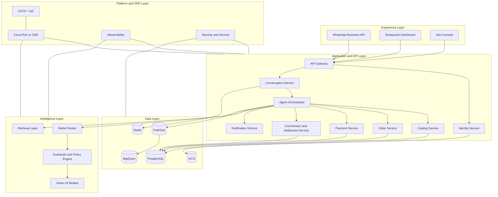

## 5.3 End-to-End Request Flow (WhatsApp order)

1. Customer sends message in WhatsApp
2. Channel webhook enters API Gateway
3. Identity service resolves customer and restaurant tenant context
4. Agent Orchestrator calls tools:
- Menu retrieval
- Pricing and commission preview
- Payment intent creation
5. Agent responds with structured choices and payment CTA
6. Payment confirmation event updates Order service
7. Settlement service computes split and schedules payout
8. Notification service informs customer and restaurant

## 5.4 Architecture Diagram (Order and Payment Data Flow)

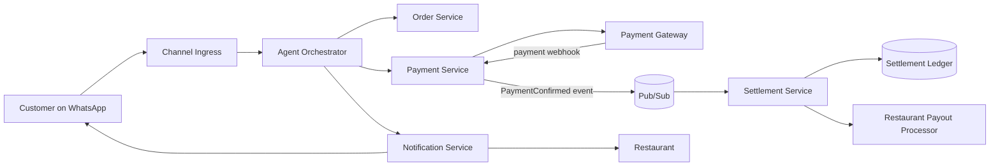

## 5.5 Architecture Diagram (Trust Boundaries)

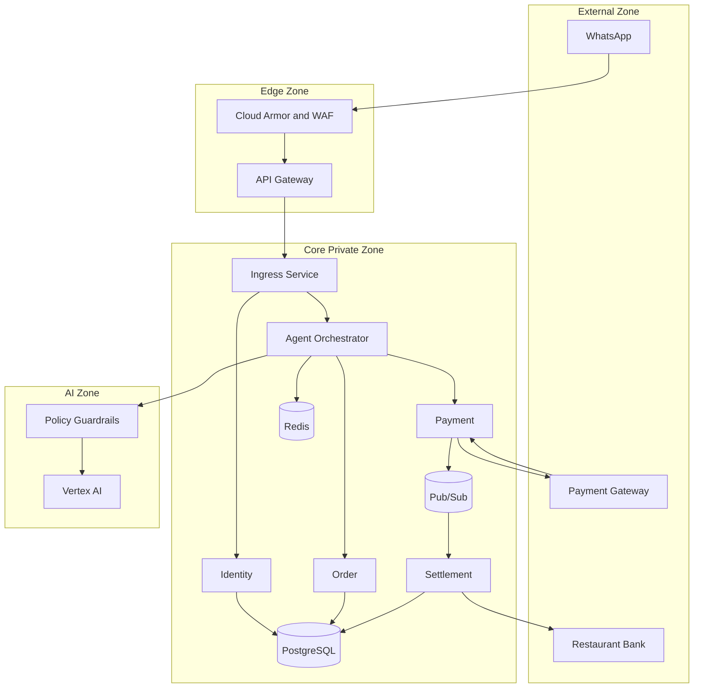

## 5.6 Architecture Diagram (GCP Deployment View)

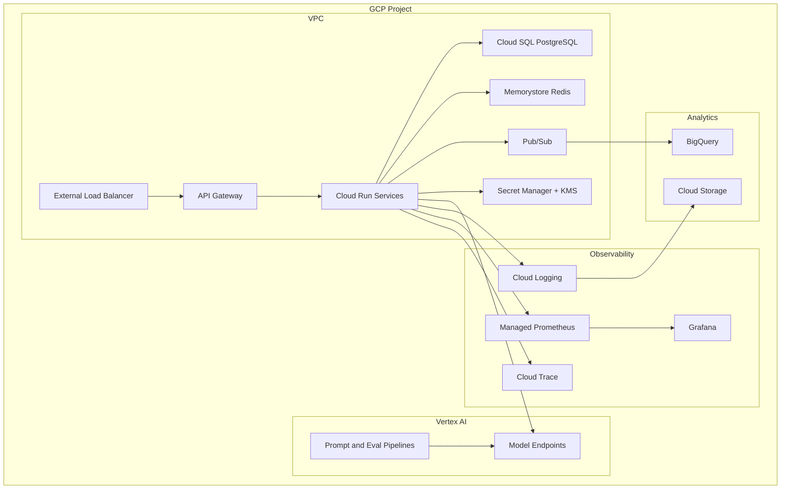

## 6) Digital Identity Architecture

Digital identity is strategic IP for Dzukku.

## 6.1 Identity Objects

Customer Identity
- Stable internal customer_id
- WhatsApp phone binding
- Consent records
- Preference graph (cuisine, repeat patterns)
- Trust score (fraud/risk)

Restaurant Identity
- merchant_id and legal entity mapping
- KYC/KYB status
- Bank settlement profile
- Branch/store hierarchy
- SLA and policy profile

Conversation Identity
- session_id and linked intent history
- language profile
- context memory policy

### Diagram: Digital Identity Model

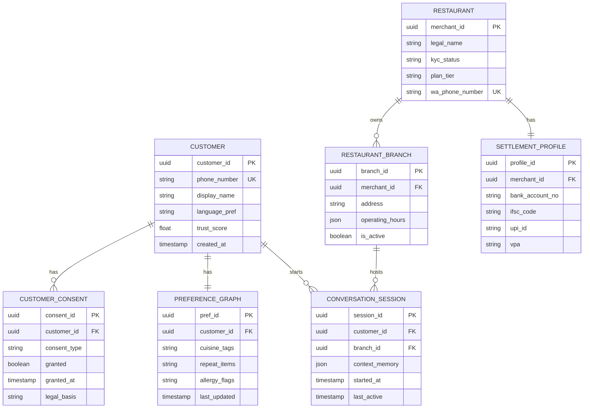

## 6.2 Identity Capabilities

- Progressive profile enrichment from conversations
- Consent-driven personalization
- Cross-restaurant interoperability where allowed by policy
- Identity federation with external providers (future)

## 6.3 Security and Compliance Controls

- OAuth 2.1 / OpenID Connect for dashboard users
- JWT with short TTL + refresh rotation
- PII encryption at rest and field-level encryption for sensitive fields
- Signed webhooks and replay protection
- RBAC + ABAC for operations
- Data retention and right-to-delete workflows

### Diagram: Identity and Auth Flow

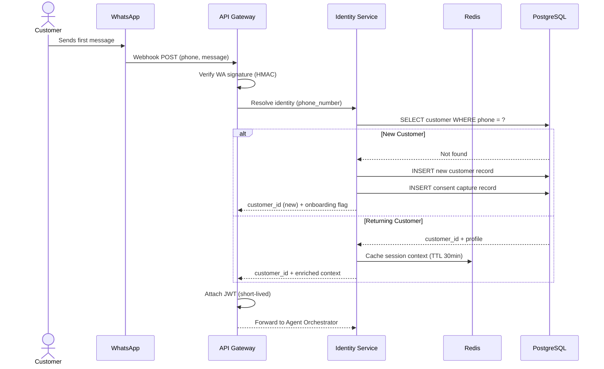

## 7) Commission and Settlement Design

Goal: transparent, low-cut commission while guaranteeing payouts.

## 7.1 Money Flow Model

Option A (recommended): direct-to-restaurant payment with platform fee invoice
- Customer pays restaurant account or merchant gateway
- Dzukku generates periodic fee reconciliation
- Lowest compliance burden for handling customer funds

Option B: split settlement through payment gateway
- Payment captured in a master arrangement
- Real-time split sends restaurant share + platform fee
- Better automation but higher compliance and provider dependency

### Diagram: Commission and Money Flow (Option A vs Option B)

```mermaid
flowchart TB
    subgraph A ["Option A — Recommended (Direct to Restaurant)"] 
        CA([Customer]) -->|"Pays full amount"| RA([Restaurant Payment Account])
        RA -->|"Periodic fee invoice (monthly/weekly)"| DZA(["Dzukku Platform\nFee Collection"])
        DZA -->|"Net settlement to restaurant"| BKA([Restaurant Bank Account])
    end

    subgraph B ["Option B — Split Settlement (via Gateway)"]
        CB([Customer]) -->|"Full payment captured"| PGW(["Payment Gateway\n(Razorpay / Stripe)"])
        PGW -->|"Instant platform fee split"| DZB(["Dzukku Platform\nWallet/Ledger"])
        PGW -->|"Instant restaurant share"| BKB([Restaurant Bank Account])
    end
```

## 7.2 Commission Rule Engine

Inputs:
- Restaurant plan tier
- Order channel (direct repeat vs new discovery)
- Campaign attribution
- Delivery involvement

Outputs:
- Gross amount
- Taxes
- Platform fee
- Net payable to restaurant

Sample formula:
- net_restaurant = gross - tax - platform_fee - payment_processing_fee

### Diagram: Commission Calculation Engine

```mermaid
flowchart LR
    ORD(["Order Placed\nGross: ₹500"]) --> CE["Commission Rule Engine"]

    subgraph CE ["Commission Engine Inputs"]
        TI["Plan Tier: Growth (8%)"] 
        CH["Channel: Repeat Customer (-2%)"] 
        AT["Attribution: Organic (no campaign fee)"] 
        DL["Delivery: Self (no delivery fee)"]
    end

    CE --> CALC["Calculate"]
    CALC --> BK["Breakdown"]

    subgraph BK ["Fee Breakdown"]
        G["Gross: ₹500.00"]
        TX["GST (5%): -₹25.00"]
        PF["Platform Fee (6%): -₹30.00"]
        PX["Payment Processing (2%): -₹10.00"]
        NET["Net to Restaurant: ₹435.00"]
    end

    BK --> LD[("Settlement Ledger")]
    BK --> DASH(["Restaurant Dashboard\nFee Breakdown"])
```

### Diagram: Settlement Sequence

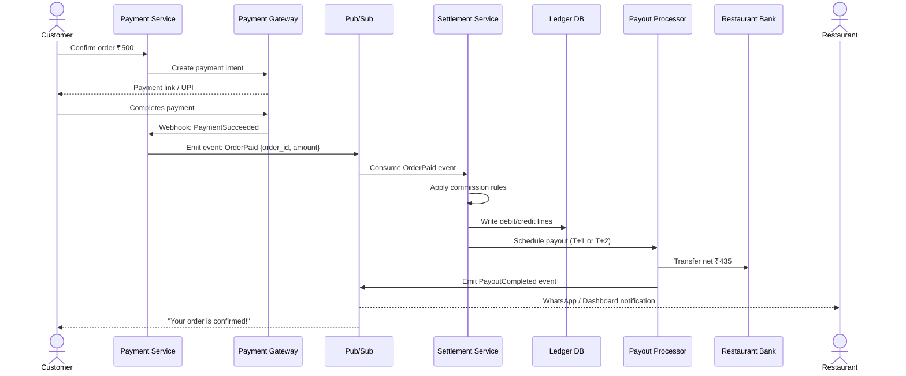

## 7.3 Transparency Features

- Per-order fee breakdown in restaurant dashboard
- Settlement timeline tracker
- Dispute and adjustment ledger

## 8) Agentic AI System Design

## 8.1 Agent Roles

- Concierge Agent: discover menu and recommend
- Transaction Agent: cart, pricing, and order confirmation
- Policy Agent: refunds, substitutions, SLA handling
- Ops Agent: restaurant-side insights and automation

## 8.2 Agent Orchestration Pattern

- LLM does planning and response synthesis
- Tool execution remains deterministic in backend services
- Every tool call logged with policy checks
- Human fallback when confidence drops below threshold

### Diagram: Agentic AI Reasoning Loop (ReAct Pattern)

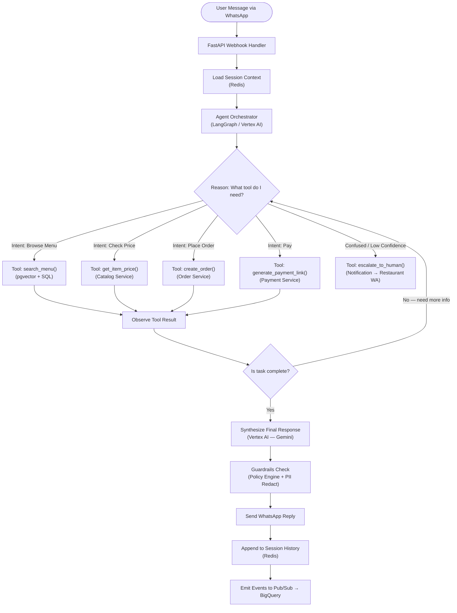

## 8.3 Retrieval and Grounding

Knowledge sources:
- Restaurant menu and metadata
- Operating hours and dynamic availability
- Promotions and constraints
- Policy and FAQ knowledge base

Use hybrid retrieval:
- Keyword + vector retrieval
- Metadata filtering by tenant_id and branch_id
- Strict citation mode for policy-sensitive responses

### Diagram: Hybrid Retrieval Architecture (RAG)

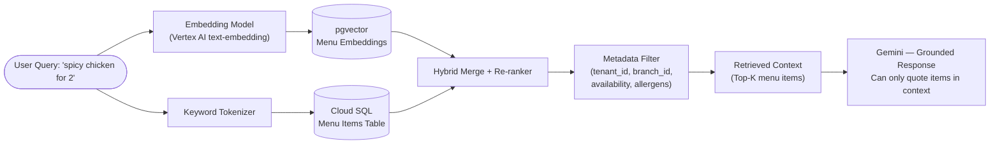

## 8.4 AI Guardrails

- Prompt injection detection
- Output schema validation
- PII and payment data redaction
- Toxicity/safety classifier
- Hallucination risk controls by forcing tool-backed answers on transactional intents

### Diagram: Guardrails Pipeline

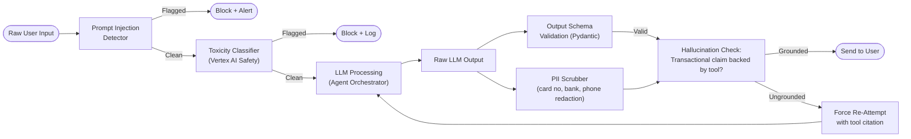

## 9) Technology Choices (Modern, Production-Oriented)

## 9.1 Backend Framework: Flask vs FastAPI

Recommendation: FastAPI

Why FastAPI is better for this architecture:
- Native async support for high-concurrency webhook and AI tool workflows
- Strong request/response validation via Pydantic
- Auto-generated OpenAPI docs for partner integrations
- Better performance for I/O heavy operations

When Flask is still acceptable:
- Small monolithic MVP with limited integrations
- Minimal async requirements

Final call:
- Use FastAPI for core platform services
- Flask can remain for legacy scripts/internal tools only

## 9.2 Cloud Platform (GCP + Vertex AI)

Recommended stack:
- Compute: Cloud Run (early) then GKE (scale/complex orchestration)
- API Management: API Gateway or Apigee (enterprise)
- Database: Cloud SQL for PostgreSQL
- Cache: Memorystore (Redis)
- Messaging: Pub/Sub
- Files: Cloud Storage
- Analytics: BigQuery
- Secrets: Secret Manager
- IAM and network controls: VPC + private service connect
- AI: Vertex AI (Gemini models + model tuning + safety + eval)

Code or no-code with Vertex AI?
- No-code (Vertex Studio) is great for fast prompt iteration and evaluation
- Code (Vertex SDK + orchestration service) is required for production agent workflows

Recommendation:
- Hybrid approach: no-code for prototyping, code-first for production runtime

## 9.3 Additional Modern Technologies

- Workflow orchestration: Temporal or Google Workflows (settlement/retries)
- Feature flags: OpenFeature compatible system
- Policy engine: OPA (Open Policy Agent)
- Event contracts: AsyncAPI + schema registry
- Infrastructure as Code: Terraform
- CI/CD: GitHub Actions + Cloud Deploy
- Observability: OpenTelemetry + Prometheus + Grafana + Cloud Logging
- Security scanning: SAST, dependency scanning, container scanning

## 10) Proposed Microservice Boundaries

1. Identity Service
- Customer and merchant profiles, consent, authn/authz

2. Conversation Service
- Session state, WhatsApp event normalization

3. Agent Orchestrator Service
- Planning, tool routing, safety enforcement

4. Catalog Service
- Menus, variants, availability, pricing metadata

5. Order Service
- Cart, order lifecycle, status transitions

6. Payment Service
- Payment intents, confirmation, reconciliation hooks

7. Commission and Settlement Service
- Commission calculation, payout schedule, ledger

8. Notification Service
- WhatsApp confirmations, fallback channels

9. Analytics Service
- KPIs, cohort, restaurant intelligence

### Diagram: Microservice Interaction Map

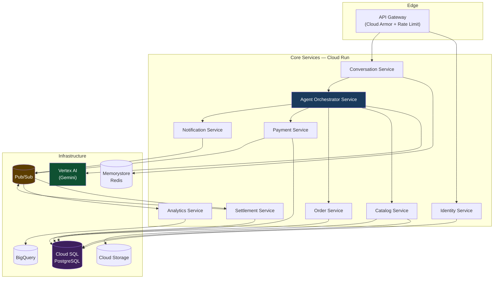

## 11) Data Model (Core Entities)

- customer
- customer_consent
- restaurant
- restaurant_branch
- menu
- menu_item
- conversation_session
- message_event
- cart
- order
- payment_intent
- settlement_ledger
- commission_rule
- payout
- audit_event

### Diagram: Core Order Data Model (ERD)

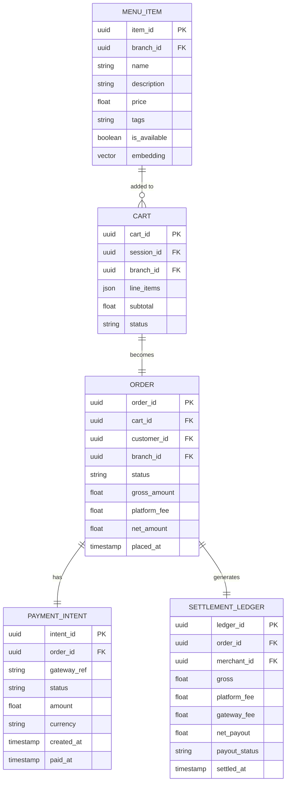

## 12) API Design Standards

- REST + event-driven callbacks
- Idempotency keys for payment/order creation
- Correlation IDs on every request
- Versioned APIs (/v1, /v2)
- Strict schema contracts and backward compatibility policy

## 13) Reliability, Performance, and Scale Targets

SLO targets:
- API availability: 99.95%
- Median webhook processing latency: < 300 ms
- P95 transaction response latency: < 1.5 s (excluding user wait states)
- Order creation reliability: > 99.99% successful state persistence

Scalability patterns:
- Stateless services with horizontal autoscaling
- Queue-based backpressure for downstream dependencies
- Read replicas for heavy read paths
- Cache hot menu and profile objects

## 14) Security and Risk Architecture

- OWASP ASVS controls baseline
- Zero trust internal service auth (mTLS/service identity)
- WAF and rate limiting at edge
- Fraud signals for repeated failed payments / abuse
- Immutable audit logs for payout-affecting events
- Periodic penetration testing and threat modeling

## 15) DevOps and Environment Strategy

Environments:
- dev, staging, pre-prod, prod

Release strategy:
- Trunk-based development
- Canary deployments for agent changes
- Blue-green for critical payment/settlement services

Operational readiness:
- Runbooks per service
- Error budget policy
- On-call escalation matrix

## 16) Rollout Plan (Phase-wise)

Phase 1: Foundation (0-8 weeks)
- FastAPI monolith with modular architecture
- WhatsApp integration
- Basic order + payment + commission calculator
- Identity baseline and consent capture

Phase 2: Production hardening (8-16 weeks)
- Service extraction (Identity, Order, Settlement)
- Event-driven architecture with Pub/Sub
- Observability, SLO dashboards, alerting
- Vertex AI agent orchestration with guardrails

Phase 3: Scale and intelligence (16-32 weeks)
- Advanced personalization and memory
- Restaurant intelligence dashboards
- Multi-region failover design
- Dynamic commission optimization

### Diagram: Phased Rollout Timeline

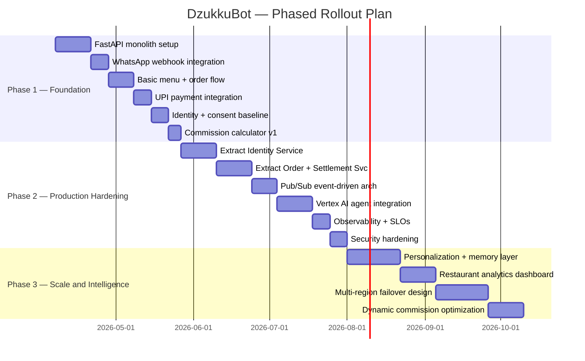

### Diagram: Full End-to-End Happy Path (Sequence)

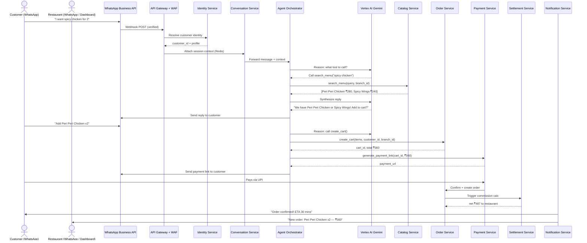

## 17) What Must Be Addressed Next (Gaps and Improvements)

Critical open items:
- Regulatory review for payment flow model by geography
- Legal design for fee invoicing vs split settlement
- WhatsApp template and policy compliance at scale
- Full data governance policy (consent, deletion, retention)
- Incident response drills for payment and payout events

High-impact improvements:
- Add human-in-the-loop console for low-confidence AI transactions
- Add evaluation harness for prompt and model drift
- Add simulation environment for commission rule changes
- Add customer identity portability framework

## 18) Architecture Decision Summary

- Use FastAPI as the primary backend framework
- Use GCP as the platform, Vertex AI for model and safety stack
- Start with Cloud Run for velocity, evolve to GKE when service graph complexity increases
- Design around digital identity and transparent low-commission settlement
- Keep transactional actions deterministic, with AI only orchestrating and assisting

## 19) PDF Export Instructions

This document is intentionally written in a PDF-ready format.

Simple export options:
- Open this Markdown in VS Code and export using a Markdown PDF extension
- Or convert via pandoc if available in your environment

Suggested output file name:
- Dzukku_Production_Architecture_v1.pdf

## 20) Final Recommendation to Your Question

For your goal (agentic AI chatbot, direct restaurant flow, digital identity, and production-level system design), FastAPI is the stronger foundation than Flask.

Use Vertex AI on GCP with a hybrid approach:
- No-code for rapid prompt experiments and evaluation
- Code-first orchestration for real production behavior, governance, and scalability

## 21) Pre-Project Learning Resources and Roadmap

Use this learning track before implementation so the team starts with shared foundations.

### 21.1 Core Backend Foundation (Week 1)

1. FastAPI official docs  
    https://fastapi.tiangolo.com/
2. Python async and asyncio  
    https://docs.python.org/3/library/asyncio.html
3. Pydantic docs  
    https://docs.pydantic.dev/latest/
4. SQLAlchemy 2.0 docs  
    https://docs.sqlalchemy.org/en/20/

### 21.2 Webhooks and Messaging (Week 1)

1. Meta WhatsApp Cloud API docs  
    https://developers.facebook.com/docs/whatsapp/cloud-api
2. Webhook reliability and signature best practices  
    https://stripe.com/docs/webhooks
3. HTTP idempotency reference  
    https://developer.mozilla.org/en-US/docs/Glossary/Idempotent

### 21.3 GCP and Production Deployment (Week 2)

1. Cloud Run docs  
    https://cloud.google.com/run/docs
2. API Gateway docs  
    https://cloud.google.com/api-gateway/docs
3. Cloud SQL for PostgreSQL docs  
    https://cloud.google.com/sql/docs/postgres
4. Pub/Sub docs  
    https://cloud.google.com/pubsub/docs
5. Secret Manager docs  
    https://cloud.google.com/secret-manager/docs
6. IAM overview  
    https://cloud.google.com/iam/docs/overview

### 21.4 Agentic AI and Vertex AI (Week 2)

1. Vertex AI documentation  
    https://cloud.google.com/vertex-ai/docs
2. Gemini on Vertex AI reference  
    https://cloud.google.com/vertex-ai/generative-ai/docs/model-reference/gemini
3. RAG architecture patterns  
    https://cloud.google.com/architecture/gen-ai-rag-application-patterns
4. Prompt design fundamentals  
    https://cloud.google.com/vertex-ai/generative-ai/docs/learn/prompts/introduction-prompt-design

### 21.5 System Design and Reliability (Week 3)

1. Google SRE book  
    https://sre.google/sre-book/table-of-contents/
2. Designing Data-Intensive Applications (book)
3. OpenTelemetry documentation  
    https://opentelemetry.io/docs/

### 21.6 Payments and Settlement Domain (Week 3)

1. Razorpay documentation  
    https://razorpay.com/docs/
2. Stripe documentation (good architecture patterns)  
    https://stripe.com/docs
3. Accounting and ledger concepts for developers  
    https://www.moderntreasury.com/journal/accounting-for-developers-part-i

### 21.7 Security and Compliance Basics (Week 4)

1. OWASP ASVS  
    https://owasp.org/www-project-application-security-verification-standard/
2. OWASP API Security Top 10  
    https://owasp.org/www-project-api-security/
3. OpenID Connect overview  
    https://openid.net/developers/how-connect-works/

### 21.8 Suggested 30-Day Learning Plan

1. Days 1-7: FastAPI, async patterns, webhook fundamentals
2. Days 8-14: GCP runtime stack (Cloud Run, SQL, Pub/Sub, Secrets)
3. Days 15-21: Vertex AI, RAG grounding, safety guardrails
4. Days 22-30: Payments, security hardening, and SRE operations

### 21.9 Skill Validation Milestones

1. Build and test one idempotent webhook endpoint
2. Build one async API flow with external dependency timeout handling
3. Implement one event-driven order-to-settlement sample flow
4. Build one RAG response with citation-backed answers
5. Publish one dashboard with latency, error, and payment metrics
